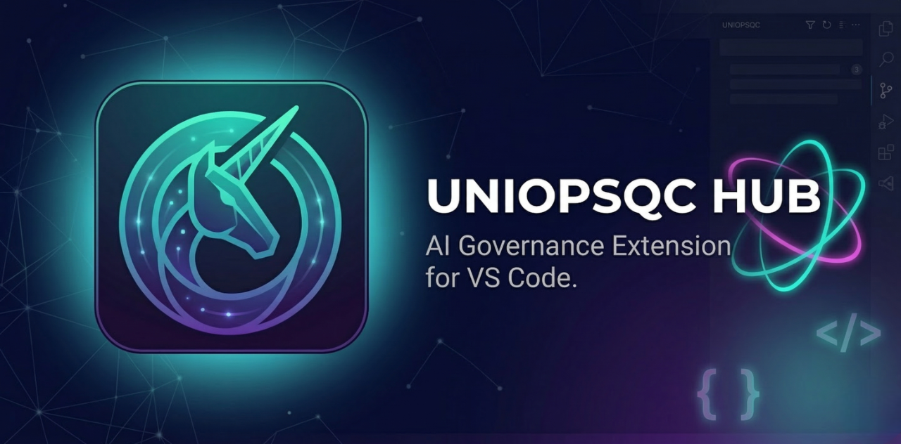

<p align="center">
  
</p>

# UniOpsQC Hub for VS Code

**ศูนย์กลางจัดการ UniOpsQC Framework** — เฟรมเวิร์กธรรมาภิบาล AI แบบหลายทีมสำหรับ Claude Code

โดย [Unicorn Tech Int Co.,Ltd.](https://github.com/VarakornUnicornTech)

## ฟีเจอร์

### ติดตั้งด้วยคลิกเดียว
ติดตั้ง UniOpsQC Framework เข้าสู่ workspace ใด ๆ ด้วยคลิกเดียว ระบบจะจัดตั้งโฟลเดอร์ `.claude/` พร้อม policies, team rosters, skills และการตั้งค่าต่าง ๆ

### ตั้งค่าโปรเจกต์แบบ Visual
กำหนดค่า `ProjectEnvironment.md` ผ่าน Interactive Wizard โดยไม่ต้องแก้ไขไฟล์เองด้วยมือ รองรับการเลือก Project Mode (Centralized/Decentralized), ตั้งค่า Project Root และการตั้งค่าทีม

### ตรวจสอบเวอร์ชันและแจ้งเตือนอัปเดต
ตรวจสอบอัปเดตเฟรมเวิร์กโดยอัตโนมัติเมื่อเปิดโปรแกรม เปรียบเทียบเวอร์ชันปัจจุบันกับ Release ล่าสุด และดูสิ่งที่เปลี่ยนแปลงใน Changelog

### Smart Update Manager
ตรวจสอบการเปลี่ยนแปลงทีละไฟล์พร้อมคำแนะนำการ Merge จาก AI เลือกใช้การอัปเดตเฉพาะส่วนที่ต้องการ พร้อมสำรองข้อมูลอัตโนมัติและ Rollback ด้วยคลิกเดียว

### Session Log Dashboard
เรียกดูประวัติ RoundTable Session โดยตรงจาก Sidebar ดูสถิติ Session, สถานะเปิด/ปิด และคลิกเปิดไฟล์ Log ได้ทันที

### Visual ProjectEnvironment Editor
เพิ่ม แก้ไข และลบโปรเจกต์ผ่าน Sidebar Form UI โดยไม่ต้องแก้ไข Markdown ด้วยตนเอง

### Framework Health Check
ตรวจสอบความสมบูรณ์ของเฟรมเวิร์กพร้อมคะแนนและรายงานสถานะทีละไฟล์ ครอบคลุม Core Files, Policies และ Team Rosters

### Policy Browser
เรียกดูและเปิดไฟล์ Policy ด้านธรรมาภิบาลทั้งหมดโดยตรงจาก Sidebar เข้าถึงทุก Section ของ UniOpsQC Policy ได้อย่างรวดเร็ว

### Team Roster Viewer
ดูรายชื่อทีม สมาชิก บทบาท และความรับผิดชอบในรูปแบบ Collapsible Tree View คลิกเปิดไฟล์ Roster เต็มรูปแบบได้

### Session Statistics
ติดตามกิจกรรม UniOpsQC Session ด้วยตัวชี้วัด เช่น จำนวน Session ทั้งหมด ค่าเฉลี่ยต่อวัน ความต่อเนื่องของกิจกรรม และการมีส่วนร่วมของทีม

### Quick Session Open
ปุ่มเปิด/สร้างไฟล์ RoundTable Session ของวันนี้ด้วยคลิกเดียว ไม่ต้องค้นหาไฟล์เอง

### Push to Hub (Subscription)
ส่งโปรเจกต์ไปยัง Hub API ที่เชื่อมต่อ เพื่อการจัดการทีมและรายงานแบบรวมศูนย์

## ความต้องการของระบบ

- VS Code 1.110.0 หรือใหม่กว่า
- Git ติดตั้งแล้วและพร้อมใช้งานใน PATH
- การเชื่อมต่ออินเทอร์เน็ต (สำหรับเข้าถึง GitHub API)

## เริ่มต้นใช้งาน

1. เปิด Workspace ใน VS Code
2. คลิกไอคอน **UniOpsQC Hub** ใน Activity Bar
3. คลิก **Install UniOpsQC Framework**
4. รัน **Setup Project** เพื่อตั้งค่า Environment

## การติดตั้ง

ค้นหา **UniOpsQC Hub** ใน VS Code Extensions Marketplace หรือติดตั้งโดยตรงผ่าน Extension ID:

```
UnicornTech.roundtable-hub
```

หรือผ่าน VS Code CLI:

```bash
code --install-extension UnicornTech.roundtable-hub
```

## คำสั่ง

| คำสั่ง | คำอธิบาย |
|--------|----------|
| `UniOpsQC: Install Framework` | Clone และติดตั้งเฟรมเวิร์กเข้าสู่ Workspace |
| `UniOpsQC: Setup Project` | กำหนดค่า ProjectEnvironment.md ผ่าน Interactive Wizard |
| `UniOpsQC: Check for Updates` | เปรียบเทียบเวอร์ชันปัจจุบันกับ Release ล่าสุด |
| `UniOpsQC: Update Framework` | ใช้การอัปเดตเฟรมเวิร์กพร้อมสำรองข้อมูล |
| `UniOpsQC: Push to Hub` | ส่งโปรเจกต์ไปยัง Hub API ที่เชื่อมต่อ (Subscription) |

## การตั้งค่า

| การตั้งค่า | ค่าเริ่มต้น | คำอธิบาย |
|-----------|------------|----------|
| `roundtable.repoUrl` | `VarakornUnicornTech/UniOpsQC` | GitHub Repository สำหรับ UniOpsQC Framework Template |
| `roundtable.autoCheckUpdates` | `true` | ตรวจสอบอัปเดตอัตโนมัติเมื่อเปิดโปรแกรม |
| `roundtable.hubApiPath` | (ว่าง) | Path ของโปรเจกต์ Hub.Api สำหรับการเชื่อมต่อ Hub ในเครื่อง |
| `roundtable.hubApiUrl` | `http://localhost:5200` | URL ของเซิร์ฟเวอร์ Hub API |

## ฟรี vs Subscription

| ฟีเจอร์ | ฟรี | Subscription |
|---------|-----|-------------|
| ติดตั้งเฟรมเวิร์ก | ✓ | ✓ |
| ตั้งค่าโปรเจกต์ | ✓ | ✓ |
| ตรวจสอบอัปเดต | ✓ | ✓ |
| Quick Session Open | ✓ | ✓ |
| Update Manager | ✓ | ✓ |
| Auto-backup & Rollback | ✓ | ✓ |
| Session Log Dashboard | ✓ | ✓ |
| ProjectEnvironment Editor | ✓ | ✓ |
| Framework Health Check | ✓ | ✓ |
| Policy Browser | ✓ | ✓ |
| Team Roster Viewer | ✓ | ✓ |
| Session Statistics | ✓ | ✓ |
| Push to Hub | — | ✓ |

## Hub API Subscription

**Push to Hub** เชื่อมต่อ Workspace กับเซิร์ฟเวอร์ [UniOpsQC Hub API](https://github.com/VarakornUnicornTech/UniOpsQC) เพื่อการจัดการโปรเจกต์และรายงานทีมแบบรวมศูนย์ ฟีเจอร์อื่น ๆ ทั้งหมดใช้งานได้ฟรีโดยไม่ต้องลงทะเบียน

## เกี่ยวกับ UniOpsQC Framework

UniOpsQC คือเฟรมเวิร์กธรรมาภิบาล AI แบบหลายทีมสำหรับ Claude Code ที่เปิดใช้งานการทำงานร่วมกันอย่างมีโครงสร้างระหว่างทีม AI เฉพาะทาง (Overseer, Monolith, Syndicate, Arcade) พร้อม Policies, Logging และระบบประกันคุณภาพในตัว

Extension นี้จัดการเฟรมเวิร์กโดยตรงจากภายใน VS Code — ติดตั้ง กำหนดค่า อัปเดต และตรวจสอบ UniOpsQC Setup ได้โดยไม่ต้องออกจาก Editor

ดูข้อมูลเพิ่มเติม: [UniOpsQC Framework on GitHub](https://github.com/VarakornUnicornTech/UniOpsQC)

## การมีส่วนร่วม

พบบัก หรือมีคำขอฟีเจอร์? [เปิด Issue](https://github.com/VarakornUnicornTech/UniOpsQC-vscode/issues) บน GitHub

ดู [CONTRIBUTING.md](CONTRIBUTING.md) สำหรับการตั้งค่าการพัฒนาและแนวทางการมีส่วนร่วม

## สัญญาอนุญาต

MIT — Unicorn Tech Int Co.,Ltd.
